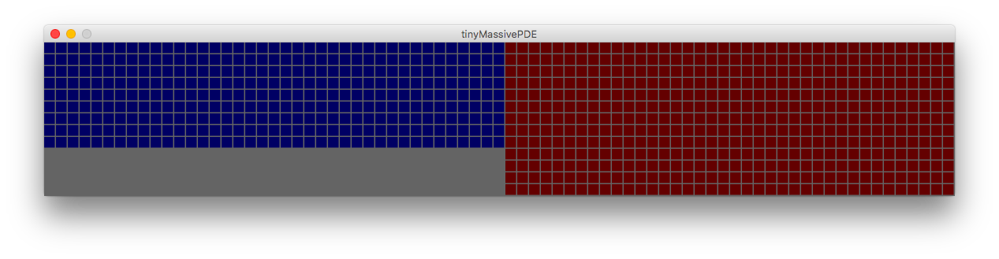
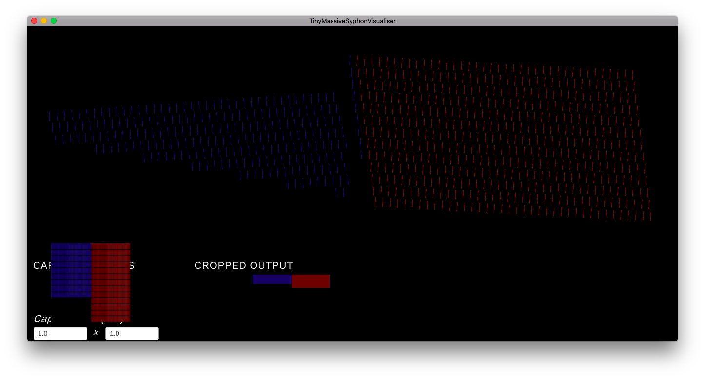

# Tiny Massive Processing template




Just a simple Processing starter file for the Tiny Massive festival (https://tinymassive.io/).

I am not in any way related to the festival organization. I did this for my own use and thought it might help others.

## Listeners

```
W, A, S, D (joystick 1 up/left/down/right)
I, J, K, L (joystick 2 up/left/down/right)
Q, E (2 generic buttons mounted next to joystick 1 )
U, O (2 generic buttons mounted next to joystick 2 )
0 (Important: this button (numpad 0) should reset the game state.)
```
